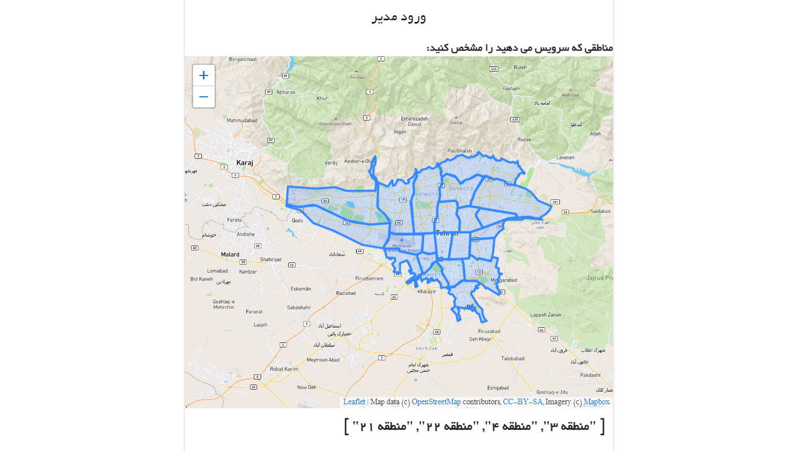
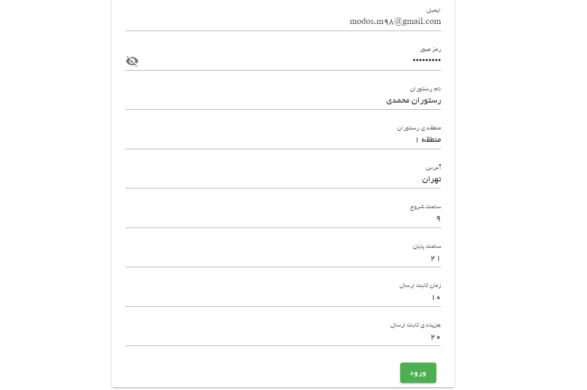
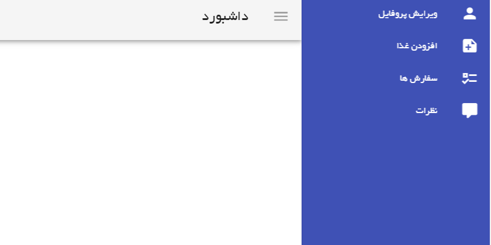
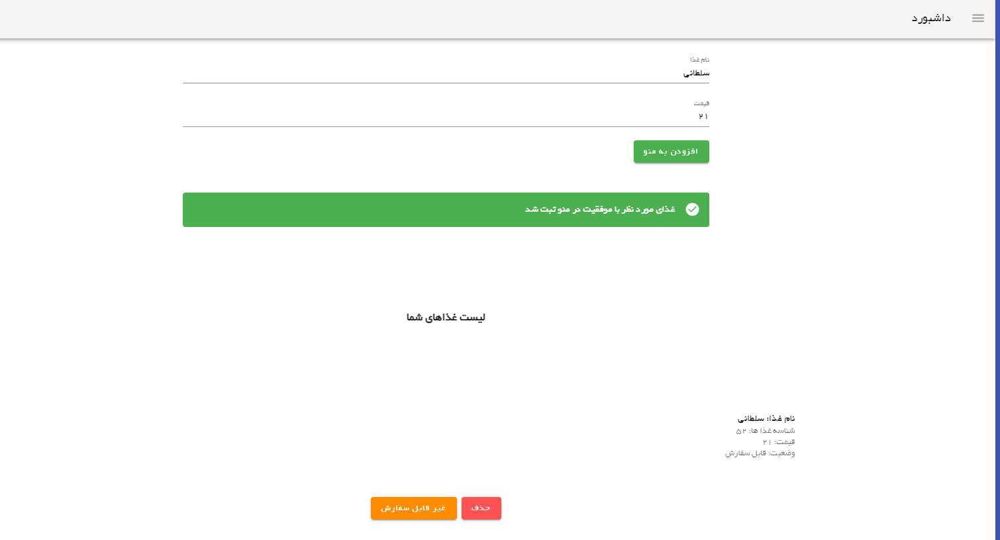
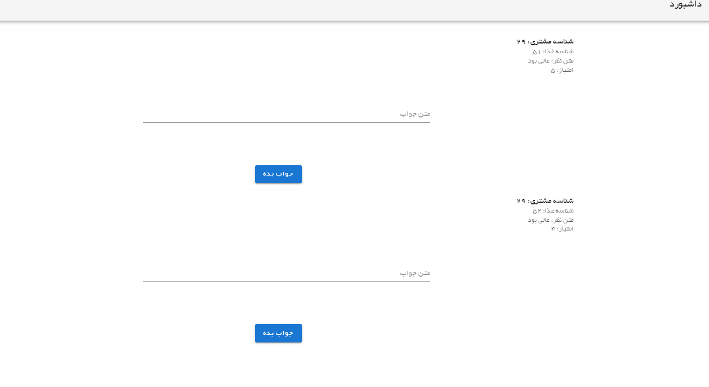
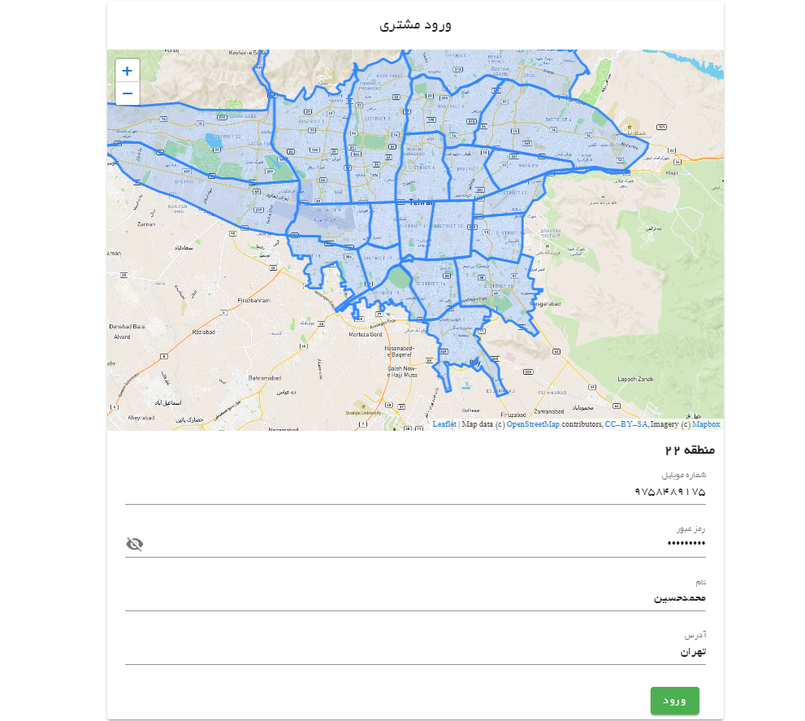
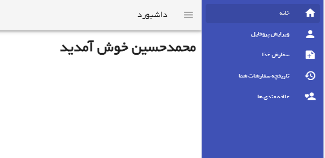
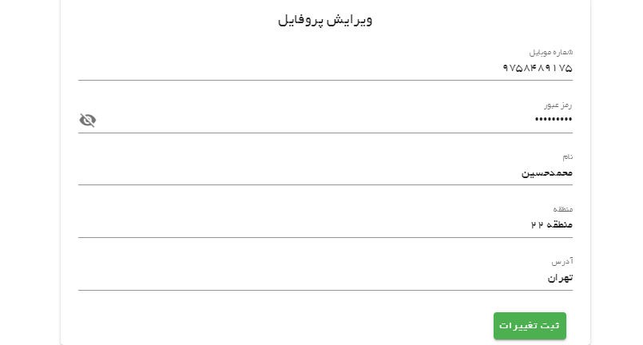
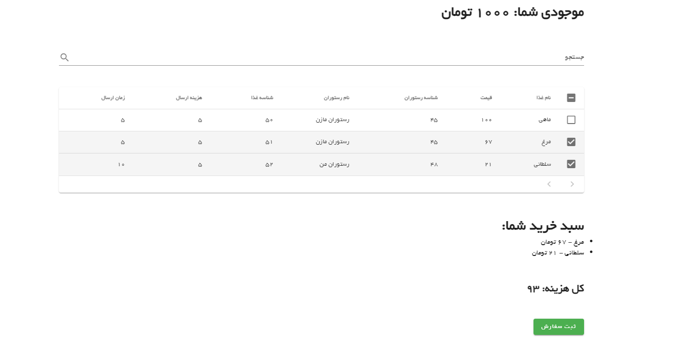
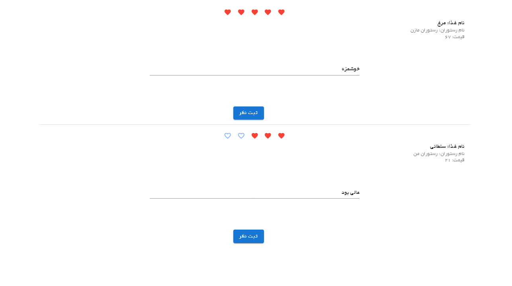

# snapp-food-clone

Backend: Nodejs + expressjs

Front: Vue + Vuetify

Database: Postgresql

### Features

✔ Map (Leaflet library and mapbox api)

✔ Dashboard

✔ Comments

✔ Edit profile

✔ Add food to restaurant menu

✔ Client can order foods

✔ Admin can see orders and deliver it

✔ and etc...

### Todo

🔴 Socket

🔴 Write Test for backend

### Admin

### Client

